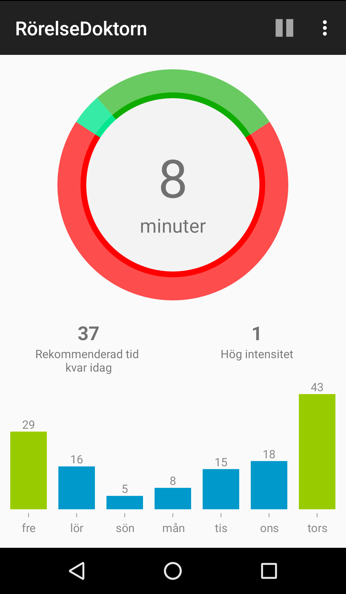
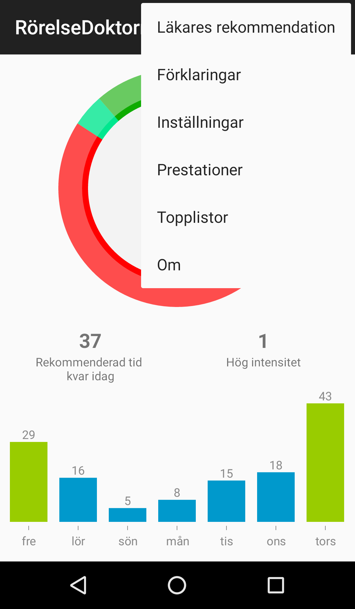
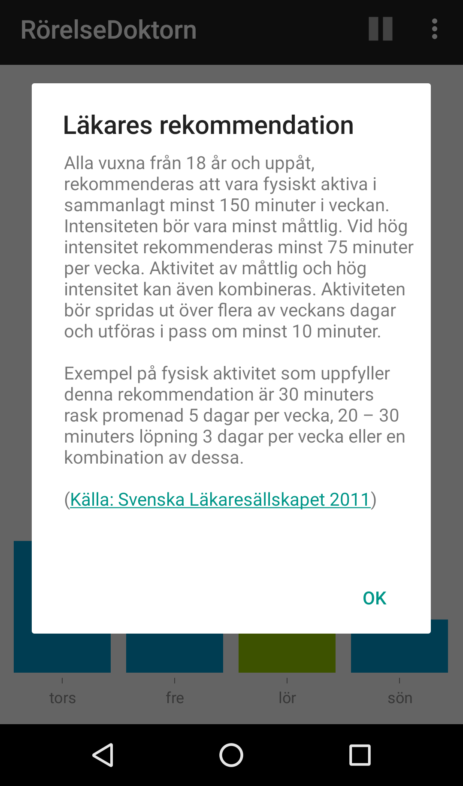
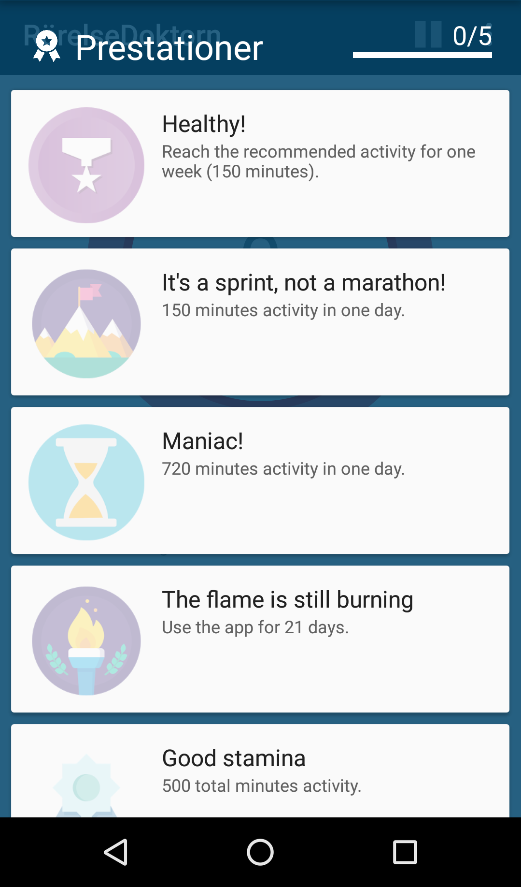
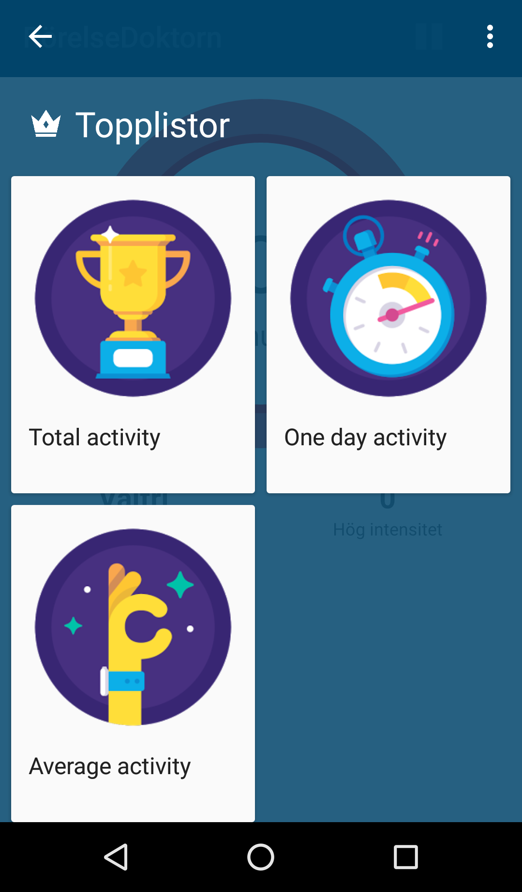

ActivityDoctor
==========================
 

  
<table style="border: 0px;">
<tr>
<td></td>
<td></td>
<td></td>
<td></td>
<td></td>
</tr>
</table>

  
  
-This android application is meant to help the user fulfill the [Swedish medical society's recommendation](http://www.yfa.se/rekommendationer-for-fysisk-aktivitet/ "Swedish medical society's recommendation") for physical activity. 
  -This application has tried to replicate [this](https://www.ncbi.nlm.nih.gov/pubmed/21616714 "this") study to get fairly correct activity minutes values for different physical intensities.
  
